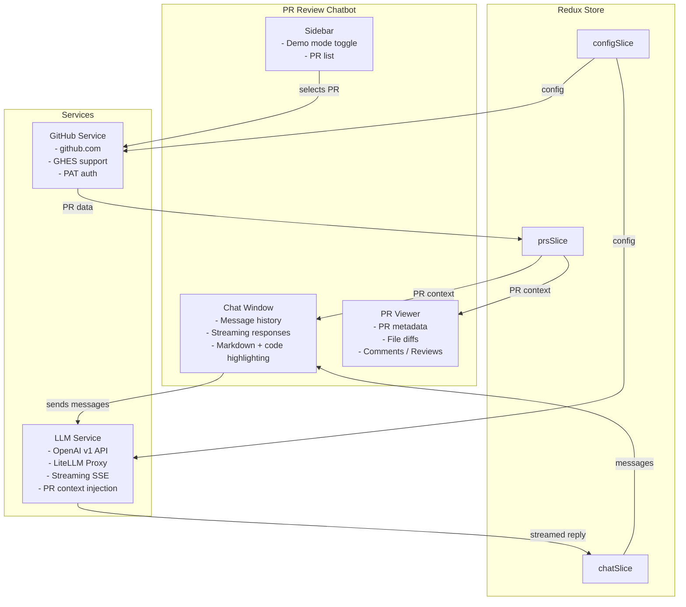

# PR Review Chatbot

A standalone web application that lets you review and ask questions about GitHub Pull Requests using an LLM. Built with React, TypeScript, and Vite.

  

---

## Features

- 💬 **Chat interface** — Ask questions about a PR in natural language
- 🤖 **LLM integration** — Supports OpenAI v1 API and LiteLLM Proxy with streaming responses
- 🎭 **Demo mode** — Try the app immediately with a sample PR, no credentials needed
- 🐙 **GitHub integration** — Works with github.com and GitHub Enterprise Server (GHES)
- 🔍 **PR context** — Injects PR metadata, file diffs, comments, and reviews into the LLM context
- 🧭 **Summary tab** — Auto-generates a PR kickoff summary in a dedicated tab (separate from chat)
- ⚙️ **Runtime configuration** — Override all settings via the Settings dialog (persisted to localStorage)
- 🌙 **Dark mode** — Toggle between light and dark themes

## Active OpenSpec Change

The repository currently has an in-progress change: `add-pr-summary-tab`.

Planned summary behavior:
- Auto-generate a PR summary when a PR is selected (enabled by default)
- Show output in a dedicated `Summary` tab (separate from chat history/context)
- Favor quick orientation: a 2-4 line overview first
- Add adaptive `Focus Areas` only when warranted, with a hard cap of 4 and no minimum
- Treat summary output with no focus areas as valid for simple PRs
- Include commit messages as first-class summary context
- Reuse session cache per PR/prompt fingerprint and rate-limit generation to one request per minute per PR head SHA

---

## Quick Start (Demo Mode)

The fastest way to try the app — no credentials required:

```bash
# 1. Clone the repository
git clone <repo-url>
cd pr-review-chatbot

# 2. Install dependencies
npm install

# 3. Start the dev server
npm run dev
```

Open [http://localhost:5173](http://localhost:5173) in your browser.

The app starts in **Demo Mode** with a pre-loaded sample PR (JWT authentication feature). You still need to configure an LLM API key to get responses — see [LLM Configuration](#llm-configuration) below.

---

## Configuration

Configuration can be set in two ways:

1. **Environment file** (`.env`) — set defaults at build time
2. **Settings dialog** — override at runtime (click the ⚙️ Settings button in the top bar)

Runtime settings are saved to `localStorage` and persist across page reloads.

### Environment File

Copy the example file and fill in your values:

```bash
cp .env.example .env
```

Edit `.env`:

```bash
# ─── GitHub ───────────────────────────────────────────────────────────────────

# Your GitHub Personal Access Token
# Required scopes: repo (for private repos) or public_repo (for public repos)
# Create one at: https://github.com/settings/tokens
VITE_GITHUB_PAT=ghp_xxxxxxxxxxxxxxxxxxxx

# GitHub instance
# Use "github.com" for GitHub.com
# Use your GHES hostname for GitHub Enterprise Server (e.g., github.mycompany.com)
VITE_GITHUB_INSTANCE=github.com

# ─── LLM ──────────────────────────────────────────────────────────────────────

# LLM backend type
# "openai"  → Direct OpenAI v1 API
# "litellm" → LiteLLM Proxy (same API format)
VITE_LLM_BACKEND=openai

# API endpoint base URL (without /chat/completions)
VITE_LLM_ENDPOINT=https://api.openai.com/v1

# Your LLM API key
VITE_LLM_API_KEY=sk-xxxxxxxxxxxxxxxxxxxx

# Model to use for chat completions
VITE_LLM_MODEL=gpt-4o

# ─── App ──────────────────────────────────────────────────────────────────────

# Start in demo mode (true/false)
# Demo mode uses a pre-loaded sample PR — no GitHub credentials needed
VITE_DEMO_MODE=true

# Enable PR summary auto-generation by default (true/false)
VITE_SUMMARY_ENABLED=true

# Optional additional summary commands appended to summary prompt
VITE_SUMMARY_COMMANDS=
```

---

## LLM Configuration

### OpenAI

```bash
VITE_LLM_BACKEND=openai
VITE_LLM_ENDPOINT=https://api.openai.com/v1
VITE_LLM_API_KEY=sk-xxxxxxxxxxxxxxxxxxxx
VITE_LLM_MODEL=gpt-4o
```

### LiteLLM Proxy

```bash
VITE_LLM_BACKEND=litellm
VITE_LLM_ENDPOINT=http://localhost:4000  # Your LiteLLM proxy URL
VITE_LLM_API_KEY=your-litellm-key        # Or leave empty if no auth
VITE_LLM_MODEL=gpt-4o                   # Or any model your proxy supports
```

### Other OpenAI-compatible APIs

Any service that implements the OpenAI v1 API format works:

```bash
# Azure OpenAI
VITE_LLM_ENDPOINT=https://<resource>.openai.azure.com/openai/deployments/<deployment>
VITE_LLM_API_KEY=your-azure-key
VITE_LLM_MODEL=gpt-4o

# Ollama (local)
VITE_LLM_ENDPOINT=http://localhost:11434/v1
VITE_LLM_API_KEY=ollama
VITE_LLM_MODEL=llama3.2

# Anthropic via LiteLLM
VITE_LLM_ENDPOINT=http://localhost:4000
VITE_LLM_MODEL=claude-3-5-sonnet-20241022
```

---

## GitHub Configuration

### GitHub.com

1. Go to [GitHub Settings → Developer settings → Personal access tokens](https://github.com/settings/tokens)
2. Create a new token (classic) with scopes:
   - `repo` — for private repositories
   - `public_repo` — for public repositories only
3. Set in `.env`:

```bash
VITE_GITHUB_PAT=ghp_xxxxxxxxxxxxxxxxxxxx
VITE_GITHUB_INSTANCE=github.com
```

### GitHub Enterprise Server (GHES)

```bash
VITE_GITHUB_PAT=ghp_xxxxxxxxxxxxxxxxxxxx
VITE_GITHUB_INSTANCE=github.mycompany.com  # Your GHES hostname (no https://)
```

The app automatically constructs the correct API URL:
- `github.com` → `https://api.github.com`
- `github.mycompany.com` → `https://github.mycompany.com/api/v3`

---

## Running the App

### Development

```bash
npm run dev
```

Starts the dev server at [http://localhost:5173](http://localhost:5173) with hot module replacement.

### Production Build

```bash
npm run build
```

Outputs to `dist/`. Serve with any static file server:

```bash
# Preview the production build locally
npm run preview

# Or serve with npx serve
npx serve dist

# Or with Python
python3 -m http.server 8080 --directory dist
```

---

## Using the App

### Demo Mode (Default)

1. Open the app — it starts in Demo Mode with a sample JWT authentication PR
2. Configure your LLM API key in **Settings** (⚙️ button in the top bar)
3. Type a question in the chat input and press **Enter**

Example questions to try:
- *"Summarize this PR"*
- *"What are the security implications of this change?"*
- *"Are there any potential bugs in the login function?"*
- *"Explain the JWT token refresh flow"*
- *"What tests are missing?"*

### GitHub Mode

1. Disable Demo Mode in the sidebar or Settings
2. Configure your GitHub PAT and instance in Settings
3. In the sidebar, enter a repository as `owner/repo` (for example, `octocat/Hello-World`)
4. Enter the PR number and click **Load PR**
5. Use the refresh button in the Pull Requests header to reload the currently selected PR

Summary behavior in GitHub mode:
- A summary request is triggered after PR metadata/files/comments/reviews/commits load
- Summary output is rendered in the `Summary` tab and is not inserted into chat history/context
- Empty textual diffs skip LLM generation and show `Nothing to Summarize`
- LLM failures show `Unable to generate summary`
- Cache is session-scoped and keyed by PR identity + head SHA + prompt/commands fingerprint
- Generation is limited to one request per minute for each PR head SHA

GitHub mode behavior:
- While data is loading, the **Load PR** button shows a spinner and inputs are disabled to prevent duplicate requests.
- Auth failures (401) prompt you to update your GitHub PAT in Settings.
- Not found errors (404) tell you to verify `owner/repo` and PR number.
- Rate limit errors (403/429) show a retry message so you can wait and refresh.
- Refresh re-fetches metadata, files, comments, review comments, and reviews for the selected PR.

### Settings Dialog

Click the **⚙️ Settings** button in the top bar to configure:

| Setting | Description |
|---------|-------------|
| Demo Mode | Toggle between demo data and real GitHub data |
| GitHub PAT | Personal Access Token for GitHub API |
| GitHub Instance | `github.com` or your GHES hostname |
| LLM Backend | `openai` or `litellm` |
| LLM Endpoint | Base URL for the LLM API |
| LLM API Key | Your API key |
| LLM Model | Model name (e.g., `gpt-4o`, `claude-3-5-sonnet`) |
| Summary Enabled | Toggle auto-generation for PR summaries |
| Summary Prompt | Editable base prompt for summary generation |
| Additional Summary Commands | Optional appended instructions for summaries |

---

## Architecture



---

## Troubleshooting

### "Configure LLM API key in Settings" warning
You need to set an LLM API key. Click ⚙️ Settings and fill in the **API Key** and **Endpoint** fields.

### LLM returns an error
- Check that your API key is correct
- Verify the endpoint URL (should not end with `/chat/completions`)
- Ensure the model name is correct for your provider
- Check browser console for detailed error messages

### Summary output expectations
- Successful summaries should start with a concise 2-4 line orientation section
- `Focus Areas` are adaptive and optional for simple PRs
- When present, `Focus Areas` should remain within 1-4 items and include where/why/what-to-verify guidance

### GitHub API errors
- Verify your PAT has the correct scopes (`repo` or `public_repo`)
- For GHES, ensure the hostname is correct (no `https://` prefix)
- Check that your PAT hasn't expired
- If you get a 404, confirm the `owner/repo` and PR number are correct
- If you hit rate limits, wait briefly, then use the sidebar refresh button

### CORS errors with LiteLLM
If you see CORS errors when using a local LiteLLM proxy, add CORS headers to your proxy configuration or use a browser extension to disable CORS for development.

---

## License

MIT
